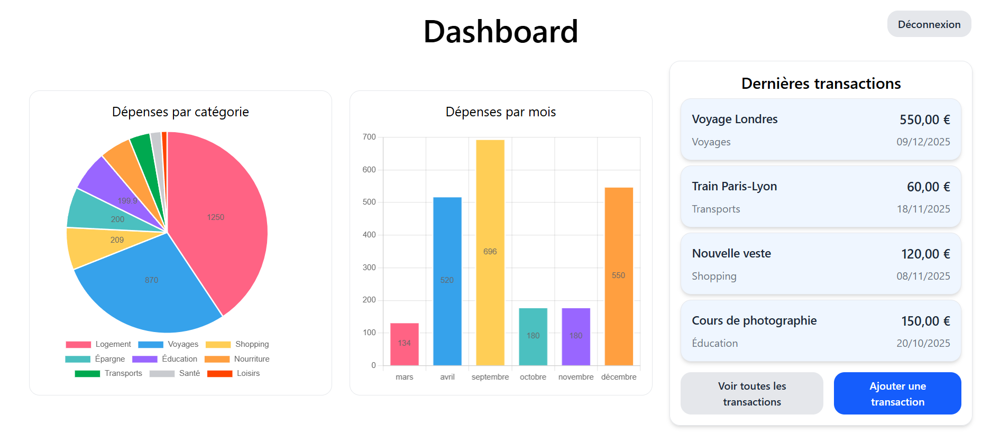

# Xpense

Xpense est une application de gestion de dépenses personnelles qui permet aux utilisateurs de suivre leurs transactions, gérer leurs budgets et visualiser l’historique de leurs dépenses facilement.

## Table des matières
1. [À propos du projet](#à-propos-du-projet)
2. [Technologies utilisées](#technologies-utilisées)
3. [Installation](#installation)
   - [Backend](#backend)
   - [Frontend](#frontend)
4. [Configuration](#configuration)
5. [Utilisation](#utilisation)
6. [Structure du projet](#structure-du-projet)
7. [API](#api)
8. [Démo](#démo)

## À propos du projet

Xpense a été créé pour aider les utilisateurs à mieux gérer leurs finances personnelles. Grâce à une interface simple et intuitive, l’application permet de :
- Ajouter, modifier et supprimer des dépenses
- Consulter un historique des transactions
- Visualiser les dépenses par catégorie et période

Les fonctionnalités ont été développées à partir des [user stories](doc/UserStories.md) définies au départ.

## Technologies utilisées

### Backend
- Langage / Framework : Java 21, Spring Boot
- Base de données : PostgreSQL
- Sécurité : Spring Security, JWT
- ORM : JPA / Hibernate

### Frontend
- Framework : Angular 20
- Langages : TypeScript, HTML, CSS
- UI : Tailwind CSS
- Communication avec le backend : HttpClient

## Installation

### Backend
1. Cloner le dépôt.
2. Aller dans le dossier *back*.
3. Configurer les variables d’environnement dans application.properties ou .env :
    - DB_URL : URL de la base de données
    - DB_USER : nom d’utilisateur
    - DB_PASSWORD : mot de passe
4. Lancer le backend avec Maven ou via l'IDE : `mvn spring-boot:run`

### Frontend
1. Aller dans le dossier *front*.
2. Installer les dépendances avec `npm install`.
3. Lancer le serveur de développement avec `ng serve`.
4. Accéder à l’application dans le navigateur : http://localhost:4200.

## Configuration
Avant de lancer l’application :
- S'assurer que PostgreSQL est installé et que la base de données Xpense existe.
- Modifier si besoin le fichier *application.properties* pour indiquer le username et le password associés à la base de donnée.
- Vérifie que le port backend (8080) et frontend (4200) ne sont pas utilisés.

## Utilisation
- Créer un compte utilisateur via la page d’inscription.
- Se connecter avec ses identifiants.
- Ajouter des dépenses avec montant, catégorie et date.
- Consulter le tableau de bord pour visualiser l’historique et le budget.
- Modifier ou supprimer des dépenses si nécessaire.

Pour plus de détails sur l'utilisation du projet, se référer à la [Documentation utilisateur](doc/DocUtilisateur.md).

## Structure du projet

### Backend

Le backend est organisé sous forme d’API REST. Les **controllers** reçoivent les requêtes HTTP et les transmettent aux **services** correspondants, qui contiennent la logique métier. Les **repositories** se chargent de l’accès aux données, en communiquant avec la base via JPA.

### Frontend

Le frontend est développé avec Angular en utilisant uniquement des composants standalone. Chaque **composant** affiche une vue spécifique et gère les interactions avec l’utilisateur. Les **services** permettent de communiquer avec le backend via HTTP pour récupérer ou envoyer des données.

### API
Voici les principaux endpoints du backend :
- POST /api/auth/login : connexion utilisateur
- GET /api/transaction/all : récupérer toutes les dépenses de l’utilisateur connecté
- POST /api/transaction : ajouter une transaction (avec les informations associées)
- PUT /api/transaction/{id} : modifier une transaction existante
- DELETE /api/transaction/{id} : supprimer une transaction

Pour plus de détails sur la structure du projet, se référer à la [Documentation technique](doc/DocTechnique.md).

## Démo

Cliquer sur l'image ci-dessous pour accéder à une vidéo de démonstration de l'application. Il se peut qu'il ne soit pas possible de la lire depuis GitHub. Mais c'est un fichier mp4 donc il suffit de la télécharger pour la visionner avec n'importe quel lecteur vidéo.

